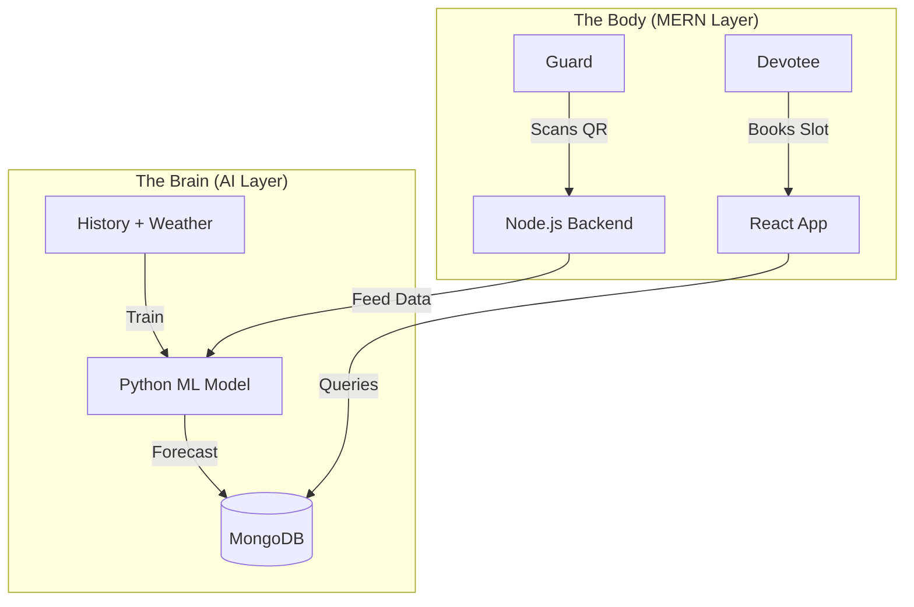

# 🕉️ Temple Smart E-Pass & AI Crowd Control
### *Somnath • Dwarka • Ambaji • Pavagadh*

> **AI-Optimized Digital Queuing Platform for Safer Pilgrimages**

<div align="center">

[](https://opensource.org/licenses/MIT)
[](https://reactjs.org/)
[](https://scikit-learn.org/)
[](https://github.com/kozakurasee/react-qr-code)

</div>

---

## 🧠 The "Smart" Difference

Traditional ticketing systems are static. **This system is Intelligent.**
It doesn't just issue tickets; it uses **AI Demand Forecasting** to dynamically adjust slot capacities, ensuring the crowd *never* exceeds safe limits, even during festivals.

---

## ✨ AI-Powered Features

### 1. 🔮 Predictive Slot Allocation (AI Engine)
*   **The Problem**: A flat "500 tickets/hour" rule fails during sudden rain or VIP visits.
*   **The AI Solution**: Our Python ML model analyzes **Holidays, Weather, and Historical Trends** to recommend dynamic caps.
    *   *Example*: "Heavy rain predicted at 5 PM -> AI increases 2 PM capacity to shift the crowd earlier."

### 2. ⏳ Real-Time Wait Estimation
*   **The Problem**: "10 AM Slot" tickets doesn't tell you how long the line is *actually*.
*   **The AI Solution**: The system analyzes real-time **Gate Scan Rates** to predict live wait times.
    *   *App Display*: "Current Wait: ~12 Mins (Fast Moving)"

### 3. 🎫 Smart Booking (Devotee Experience)
*   **Best Time to Visit**: The App highlights "Green Slots" (Low Predicted Crowd) to encourage load balancing.
*   **Secure QR Entry**: Encrypted E-Passes prevent fraud and touting.

---

## 🏗️ Architecture



---

## 🚀 Getting Started

### 1. Start the Brain (AI Service)
```bash
cd ml-services/demand-forecasting
pip install -r requirements.txt
python src/api.py
```
*Runs the Scikit-Learn prediction engine.*

### 2. Start the Body (Backend & Frontend)
```bash
cd backend && npm run dev
cd frontend && npm run dev
```

---

## 🛠️ Stack

- **Core**: MERN (MongoDB, Express, React, Node)
- **Intelligence**: Python (FastAPI, Scikit-Learn, Pandas)
- **Access**: QR Code (React-QR)

<div align="center">
  <sub>Fusion of Faith & Technology.</sub>
</div>
