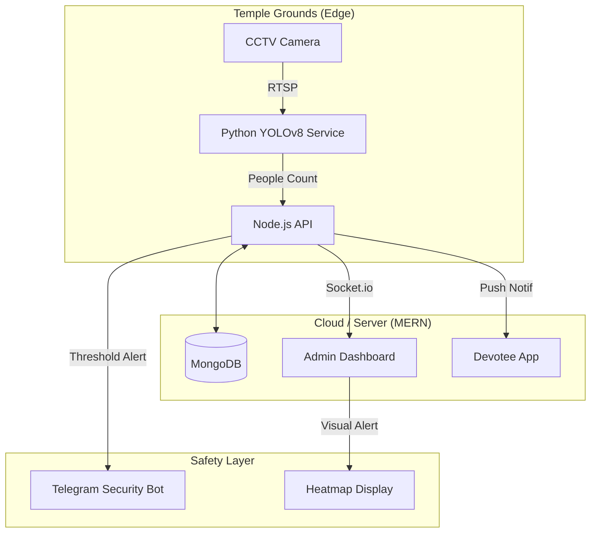

# 🕉️ Temple & Pilgrimage Crowd Management System
### *Somnath • Dwarka • Ambaji • Pavagadh*

> **AI-Powered Crowd Intelligence & Stampede Prevention for Gujarat's Holiest Sites**

<div align="center">

[](https://opensource.org/licenses/MIT)
[](https://reactjs.org/)
[](https://github.com/ultralytics/ultralytics)
[](https://www.openstreetmap.org/)

</div>

---

## 🚨 The Problem

Gujarat's major pilgrimage sites face critical crowd management challenges:
*   **Somnath & Dwarka**: Massive surges during *Mangala Aarti* and festivals like *Janmashtami* lead to dangerous crush conditions at narrow entry gates.
*   **Ambaji & Pavagadh**: Hilltop temples with limited path width and ropeway bottlenecks create "trap zones" where stampedes can occur instantly.
*   **Manual Failure**: Traditional "rope and whistle" crowd control cannot predict rapid density spikes.

## 💡 The Solution

A **Real-Time AI Command Center** specifically tuned for temple dynamics.

### 1. 👁️ Computer Vision Crowd Counting (YOLOv8)
*   **How it works**: Connects to existing CCTV feeds at Queue Complexes.
*   **What it does**: Counts devotees in real-time, estimates density per square meter.
*   **Application**: Detects "choke points" at the Pavagadh ropeway queue before they become dangerous.

### 2. 🔮 Predictive AI (LSTM)
*   **How it works**: Analyzes historical footfall data + Festival Calendar.
*   **What it does**: Predicts crowd surges 4 hours in advance.
*   **Application**: Warns temple security to open overflow waiting areas *before* the Mangala Aarti rush at Somnath.

### 3. 🎫 Virtual Queuing (MERN Stack)
*   **How it works**: Devotees book "Darshan Slots" via mobile app.
*   **What it does**: Distributes the crowd load evenly throughout the day.
*   **Application**: Reduces the physical line at Dwarkadhish by 60%.

---

## 🏗️ Architecture



---

## 🚀 Getting Started

### Prerequisites
- **Node.js** v18+
- **Python** 3.9+
- **Docker** (Optional)

### Installation

1.  **Clone the Repo**
    ```bash
    git clone https://github.com/ByteAcumen/temple-crowd-management.git
    cd temple-crowd-management
    ```

2.  **Start the Backend (Brain)**
    ```bash
    cd backend
    npm install
    npm run dev
    ```

3.  **Start the AI Service (Eyes)**
    ```bash
    cd ml-services/crowd-detection
    pip install -r requirements.txt
    python src/api.py
    ```

---

## 📜 Legal & Ethical
*   **Privacy**: This system counts *people*, it does not recognize *faces*. No PII is stored.
*   **Safety**: Designed as a decision-support tool for human security teams, not an autonomous gate controller.

<div align="center">
  <sub>Dedicated to the safety of millions of pilgrims.</sub>
</div>
