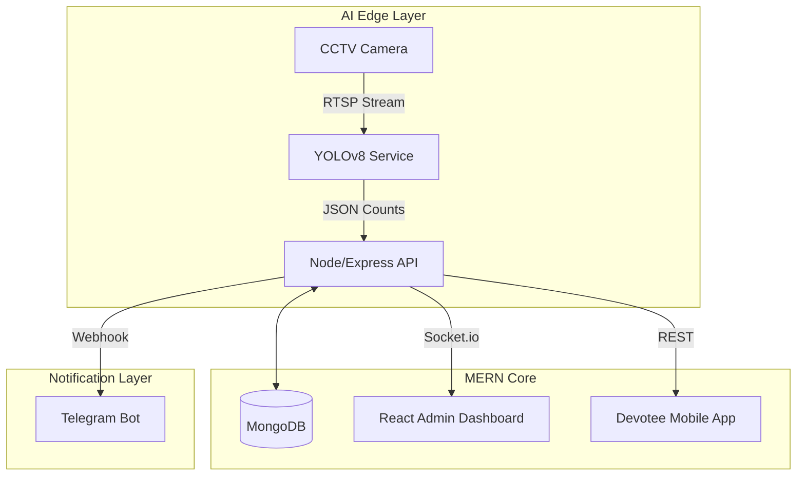

# 🕉️ Temple & Pilgrimage Crowd Management System

> **Next-Gen AI Crowd Monitoring for Indian Heritage Sites**  
> *Somnath • Dwarka • Ambaji • Pavagadh*

<div align="center">

[](https://opensource.org/licenses/MIT)
[](https://reactjs.org/)
[](https://github.com/ultralytics/ultralytics)
[](https://www.openstreetmap.org/)
[](#)

</div>

---

## 📖 Overview

The **Temple Crowd Management System** is a 100% free-to-deploy, open-source platform designed to ensure safety and efficiency at high-traffic pilgrimage sites. By leveraging **Computer Vision** and **Real-Time Data**, it prevents stampedes and optimizes the devotee experience without expensive infrastructure.

### 🚀 Key Philosophies
- **Zero Cost Deployment**: Built strictly on free-tier and open-source technologies.
- **Privacy First**: No facial recognition storage; only count and density metrics.
- **Easy to Run**: Dockerized setup for "One Click" deployment.

---

## ✨ Features

| Feature | Tech Stack | Description |
| :--- | :--- | :--- |
| **👀 AI Crowd Counting** | **YOLOv8** + **Python** | Real-time people detection from standard CCTV feeds. |
| **🗺️ Live Heatmaps** | **React** + **Leaflet** | Dynamic density visualization on OpenStreetMap. |
| **🚨 Smart Alerts** | **Telegram Bot API** | Instant congestion warnings sending directly to security staff phones. |
| **🔮 Forecasting** | **LSTM** / **Prophet** | Predict crowd surges 7 days in advance. |
| **📱 Devotee App** | **React Native** | Live darshan wait-times and digital slot booking. |

---

## 🏗️ Architecture (Visualized)



---

## 🛠️ Technology Stack

We chose the **MERN Stack** for its scalability and ubiquitous developer support, paired with Python for robust ML capabilities.

- **Frontend**: React 18, TailwindCSS, DaisyUI, React-Leaflet
- **Backend**: Node.js, Express, Socket.io
- **Database**: MongoDB (Community Edition)
- **AI/ML**: Python 3.9, FastAPI, Ultralytics YOLOv8
- **Alerts**: Telegram Bot API (Free unlimited notifications)

---

## 🚀 Getting Started

### Prerequisites
- **Node.js** v18+
- **Python** 3.9+
- **Docker** (Optional, for containerized run)

### 1. Installation

**Clone the repository**
```bash
git clone https://github.com/your-username/temple-crowd-management.git
cd temple-crowd-management
```

### 2. Run Locally (The "Easy" Way)

We have separate services for Backend, Frontend, and ML.

**Start Backend**
```bash
cd backend
npm install
# Create a .env file based on .env.example
npm run dev
```

**Start Frontend**
```bash
cd frontend
npm install
npm run dev
```

**Start AI Service**
```bash
cd ml-services/crowd-detection
pip install -r requirements.txt
python src/api.py
```

---

## 📂 Project Structure

```bash
temple-crowd-management/
├── backend/            # Express API & WebSocket Server
├── frontend/           # React Admin Dashboard
├── mobile/             # React Native App (Repo)
├── ml-services/        # Python AI Microservices
│   ├── crowd-detection # YOLOv8 Inference Engine
│   └── forecasting     # Predictive Models
└── docs/               # Documentation
```

---

## 🤝 Contributing

We welcome contributions! Please check the [Issues](https://github.com/your-username/temple-crowd-management/issues) tab.

1. Fork the Project
2. Create your Feature Branch (`git checkout -b feature/AmazingFeature`)
3. Commit your Changes (`git commit -m 'Add some AmazingFeature'`)
4. Push to the Branch (`git push origin feature/AmazingFeature`)
5. Open a Pull Request

---

## 📄 License

Distributed under the MIT License. See `LICENSE` for more information.

<div align="center">
  <sub>Built with ❤️ for Safe Pilgrimages in India</sub>
</div>
