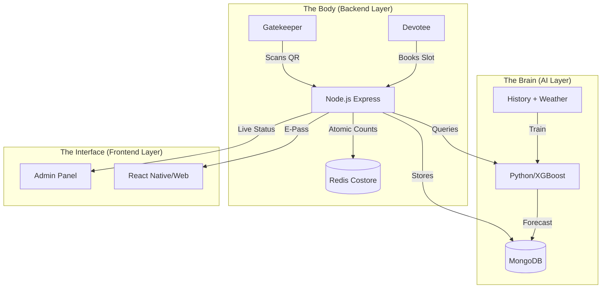

# 🕉️ Temple Smart E-Pass & AI Crowd Control
### *Somnath • Dwarka • Ambaji • Pavagadh*

> **AI-Optimized Digital Queuing Platform for Safer Pilgrimages**

<div align="center">

[](https://opensource.org/licenses/MIT)
[](https://reactjs.org/)
[](https://scikit-learn.org/)
[](https://github.com/kozakurasee/react-qr-code)
[](https://www.docker.com/)
[](https://redis.io/)

</div>

---

## 🧠 The "Smart" Difference

Traditional ticketing systems are static. **This system is Intelligent.**
It doesn't just issue tickets; it uses **AI Demand Forecasting** to dynamically adjust slot capacities and **Real-Time Redis Counters** to ensure the crowd *never* exceeds safe limits, even during festivals.

---

## ✨ Features

### 1. 🛡️ Real-Time Safety Layer (Redis)
*   **Context**: Stampedes happen when "Ticketed" people mix with "Walk-ins".
*   **Solution**: **Atomic Redis Counters** track every entry/exit in milliseconds.
*   **Live Dashboard**: A "Traffic Light" system (GREEN/ORANGE/RED) alerts admins instantly when capacity breaches 85%.

### 2. 🔮 Predictive Slot Allocation (AI Engine)
*   **The Problem**: A flat "500 tickets/hour" rule fails during sudden rain or VIP visits.
*   **The AI Solution**: Our Python ML model (XGBoost) analyzes **Holidays, Weather, and Historical Trends** to recommend dynamic caps.
    *   *Example*: "Heavy rain predicted at 5 PM -> AI increases 2 PM capacity to shift the crowd earlier."

### 3. 🤖 AI Help Bot (RAG)
*   **Devotee Support**: A built-in chatbot answers queries like *"Is it crowded right now?"* or *"What are the timings?"*.
*   **Smart**: It combines static knowledge with **Live Crowd Data** to give accurate, real-time answers.

### 4. 🔒 Enterprise-Grade Security
*   **RBAC**: Distinct roles for **Devotees**, **Gatekeepers**, and **Admins**.
*   **JWT Auth**: Stateless, secure authentication for all API interactions.

---

## 🏗️ Architecture



---

## 🚀 Getting Started

### Prerequisites
*   Docker & Docker Compose

### Fast Start (Recommended)
Run the entire stack (Backend, AI Service, Redis, Mongo) with one command:
```bash
docker-compose up --build
```

### Manual Setup
1.  **AI Service**:
    ```bash
    cd ml-services/demand-forecasting && pip install -r requirements.txt && python src/api.py
    ```
2.  **Backend**:
    ```bash
    cd backend && npm install && npm run dev
    ```

---

## 🧪 Testing
We include an automated E2E test suite.
```bash
cd backend
node test_api.js
```
*   Verifies: Registration -> Login -> AI Prediction -> Booking -> Live Entry -> Bot Query.

---

## 🛠️ Stack
- **Core**: Node.js, Express, MongoDB Mongoose
- **Intelligence**: Python (FastAPI, XGBoost)
- **Speed**: Redis (ioredis)
- **Infra**: Docker, Docker Compose
