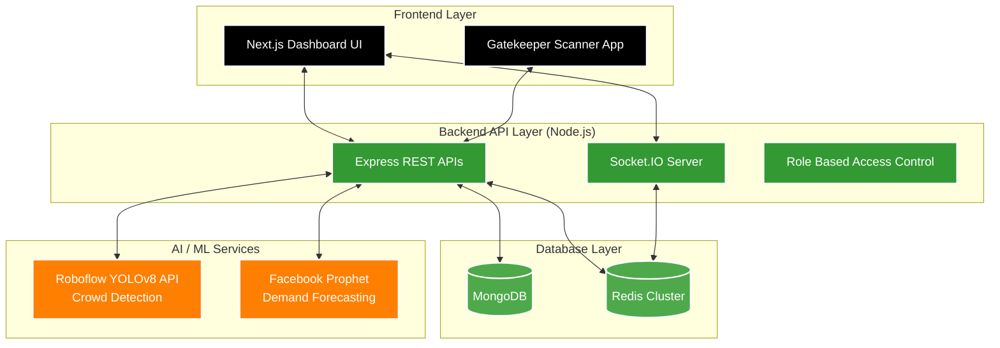

<div align="center">
  <!-- Replace with actual logo URL if available -->
  <h1>🏛️ Temple Crowd Management System</h1>
  
  <p><strong>Smart, AI-powered crowd management system for religious sites and temples.</strong></p>

  <!-- Badges -->
  <p>
    
    
    
    
    
    
  </p>
  
  <p>
    <a href="#-architecture">Architecture</a> •
    <a href="#-key-features">Key Features</a> •
    <a href="#-quick-start">Quick Start</a> •
    <a href="#-api-documentation">API Docs</a>
  </p>
</div>

<br/>

Prevents dangerous overcrowding through real-time tracking, intelligent bookings, YOLOv8 computer vision detection, and automated alerts. Designed for massive scalability and real-world deployment.

---

## 🏗️ Architecture Stack

This repository is structured as a full-stack monorepo featuring a highly scalable microservice design.



---

## 🌟 Key Features

### 🤖 1. AI Crowd Detection (YOLOv8)
Integrated with the **Roboflow Serverless API** to run state-of-the-art **YOLOv8** Object Detection. The system instantly counts people in surveillance feeds and triggers Red/Orange/Green traffic light alerts on the dashboard based purely on visual density.

### 📈 2. Demand Forecasting
Utilises the **Facebook Prophet** time-series algorithm to predict future visitor surges based on historical trends, weekends, and Indian holidays, allowing temple administration to prepare staff and resources proactively.

### ⚡ 3. Real-time Live Tracking
**Redis-backed atomic counters (INCR/DECR)** provide sub-10ms response times for Gatekeeper entry/exit scans. Coupled with **Socket.IO WebSockets**, the entire Admin Dashboard updates strictly in real-time.

### 🛡️ 4. Five-Tier Security & Hardening
- **Authentication**: JWT validation with refresh token mechanics and bcrypt hashing.
- **Strict RBAC**: Admin, Temple Admin, Gatekeeper, User isolation.
- **Layered Rate Limiting**: Independent throttling ratios for Auth (30 req), Live Tracking (200 req), and Gen-API (1000 req).
- **Hardening**: Helmet.js headers, NoSQL injection defence, and Non-root Docker execution.

### 🎟️ 5. Overbooking Prevention
Atomic MongoDB operations ensure that slot capacities (e.g., 500 people per hour) are strictly enforced, completely eliminating race conditions common in high-traffic ticketing.

---

## 🚀 Quick Start

The repository ships with multiple automated deployment scripts for Windows `Powershell` and seamless containerisation setups.

### 1-Click Startup (Local Development)
The fastest way to spin up the local Backend, Frontend, Redis, and MongoDB databases.

```powershell
.\start.ps1
```
**Features of the startup script:**
- 🧹 **Port Cleaning**: Silently kills orphaned processes holding ports `5000` (Node), `27017` (Mongo), or `6379` (Redis).
- 🐳 **Docker Automation**: Leverages named Docker volumes (`temple-mongo-data`) to ensure persistent database storage across restarts.
- 🧪 **API Verification**: Wait loops until health-check endpoints report a `200 OK` status.

### Production Execution & Verification
For rigorous production testing including E2E simulation.
```powershell
.\start-and-verify.ps1
```

### Run Full Test Suite
Executes the comprehensive Jest testing suite across the Authentication, Booking, and Live Tracking modules.
```powershell
.\test_all.ps1
```

---

## 🐳 Docker Compose Definitions

Multiple configurations exist in the root depending on your deployment target:

| Compose File | Purpose |
|--------------|---------|
| `docker-compose.local.yml` | Full local development stack (Frontend + Backend + 2 DBs) with mapped ports. |
| `docker-compose.dev.yml` | Developer stack featuring hot-reloading volume mounts. |
| `docker-compose.yml` | Standard production stack with Restart Policies. |
| `docker-compose.minimal.yml` | Lightweight stack (No Frontend, just DBs + Backend API). |

**To launch manually:**
```bash
docker-compose -f docker-compose.local.yml up -d
```

---

## 📚 General Documentation

All comprehensive architectural documentation is stored in the `docs/` folder:

- 📖 [Temple API Guide](docs/TEMPLE_API.md) - Site & Metadata CRUD
- 🛰️ [Live Tracking API](docs/LIVE_TRACKING_API.md) - Entry/Exit Atomic Tracking
- 🎟️ [Booking API](docs/BOOKING_API.md) - E-Pass Generation
- 👑 [Admin API](docs/ADMIN_API.md) - Analytics & Aggregation
- 🔌 [WebSocket Events](docs/WEBSOCKET_EVENTS.md) - Full Socket.IO Namespace details

---

## 🔐 Default Credentials

*If the database is booted fresh, the first registered user is automatically elevated to Super Admin.*

| Role | Email | Password | Access Level |
|------|-------|----------|--------------|
| **Admin** | `admin@temple.com` | `Admin@123456` | Manage Temples, Gatekeepers, Analytics |
| **Gatekeeper**| `gatekeeper@temple.com` | `Gatekeeper@123` | Scan QR codes, Trigger Entry/Exit |
| **User** | `user@temple.com` | `User@123456` | Build E-Passes, Manage Bookings |

---

## 🤝 Contributing & License

We welcome contributions! Please fork the repository, branch out from `main`, and submit a Pull Request.  

This project is licensed under the **MIT License** - see the `LICENSE` file for details.

<br/>
<div align="center">
  <b>Made with ❤️ for safer temple experiences and intelligent crowd control.</b>
</div>
